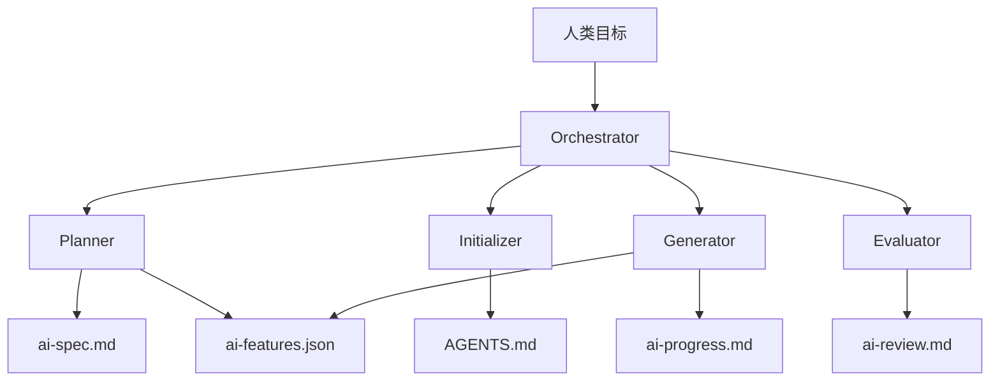

# GenUI SDK — AI Harness（Agentic 方案）

本仓库采用 **Harness Engineering** 支撑 AI Agent 跨会话、可验证地参与改造。Agent 入口：[AGENTS.md](../../AGENTS.md)。

## 架构



## 工件

| 文件 | 说明 |
|------|------|
| `AGENTS.md` | 地图、命令、铁律、会话协议 |
| `ai-spec.md` | 改造范围与风险 |
| `ai-features.json` | 特性清单（仅可改 passes/evidence/commit） |
| `ai-progress.md` | 进度日志 |
| `ai-review.md` | Evaluator 输出 |
| `scripts/ai-init.sh` | 冒烟脚本 |

## Harness 档位

| 档位 | 场景 | Evaluator |
|------|------|-----------|
| L1 | 文档/小修 | 可选 |
| L2 | 单包功能 | 建议收尾审 |
| L3 | 跨包 P0 | Sprint Contract + 循环 |

## 快速开始（Agent）

```bash
# 仓库根 — 环境冒烟
bash scripts/ai-init.sh

# 完成度报告（CI/本地门禁，未完成特性时退出码 1）
bash scripts/ai-verify.sh
# 或: pnpm ai:verify

# 阅读 AGENTS.md → ai-progress.md → 选 ai-features.json 中一条 passes:false
```

`ai-verify.sh` 环境变量：

| 变量 | 默认 | 说明 |
|------|------|------|
| `AI_VERIFY_STRICT` | `1` | `0` 时仅报告，退出码恒为 0 |
| `AI_VERIFY_RUN_INIT` | `0` | `1` 时先执行 `ai-init.sh` |

## Prompt 全文

见 [ai-harness-prompts.md](./ai-harness-prompts.md)。

## 参考

- [awesome-harness-engineering](https://github.com/ai-boost/awesome-harness-engineering)
- [Effective harnesses for long-running agents](https://www.anthropic.com/engineering/effective-harnesses-for-long-running-agents)
- [Harness design for long-running apps](https://www.anthropic.com/engineering/harness-design-long-running-apps)
