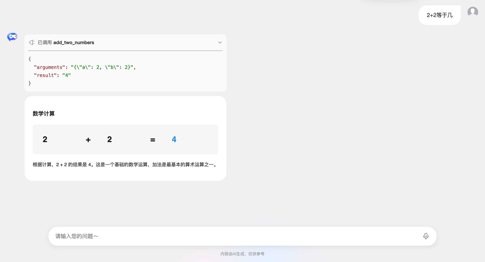

# Chat Component - Custom Fetch

The `GenuiChat` component supports a custom fetch function, allowing you to fully customize HTTP request behavior. This is useful for integrating third-party SDKs, adding authentication, handling tool calls, implementing custom streaming responses, and more.

## Parameters

- `url`: Request URL
- `options.method`: HTTP method (usually `'POST'`)
- `options.headers`: Request headers object
- `options.body`: Request body (JSON string) containing `messages`, `model`, `temperature`, and `metadata` (with processed `customComponents`, `customSnippets`, `customExamples`, and `customActions` information)
- `options.signal`: AbortSignal used to cancel the request

## Return Value

Must return a `Response` object or `Promise<Response>`. The response should follow the OpenAI-compatible streaming format (SSE), or return a standard JSON response.

## Use Cases

### Adding Authentication Headers

Pass a custom fetch function via the `customFetch` prop:

```vue
<template>
  <GenuiChat :url="url" model="deepseek-v3.2" :customFetch="customFetch" />
</template>

<script setup lang="ts">
import { GenuiChat } from '@opentiny/genui-sdk-vue';
import type { CustomFetch } from '@opentiny/genui-sdk-vue';

const url = 'https://your-chat-backend/api';

const customFetch: CustomFetch = async (url, options) => {
  // Add authentication header
  const headers = {
    ...options.headers,
    'Authorization': `Bearer ${localStorage.getItem('authToken')}`,
  };

  const response = await fetch(url, {
    ...options,
    headers,
  });

  return response;
};
</script>
```

### Handling Tool Calls and Multi-turn Conversations

Use `customFetch` to implement tool calling (Function Calling) and multi-turn conversations. The following complete example demonstrates how to do this.

#### 1. Define Tools

First, define the available tools. Each tool has two parts: `definition` (tool definition in OpenAI tool format) and `execute` (execution function).

```typescript
import OpenAI from 'openai';

/**
 * Tool to add two numbers
 */
export const addTwoNumbersTool = {
  definition: {
    type: 'function' as const,
    function: {
      name: 'add_two_numbers',
      description:
        'Adds two numbers. This is a math tool for summing two numbers. You must provide parameters a and b. Example: if a=5, b=3, returns 8.',
      parameters: {
        type: 'object',
        properties: {
          a: {
            type: 'number',
            description: 'First number to add. Required. Must be a number. Example: 5',
          },
          b: {
            type: 'number',
            description: 'Second number to add. Required. Must be a number. Example: 3',
          },
        },
        required: ['a', 'b'],
      },
    },
  },
  execute: async ({ a, b }: { a: number; b: number }) => {
    return a + b;
  },
};

/**
 * List of all available tools
 */
export const availableTools: Record<
  string,
  {
    definition: OpenAI.Chat.Completions.ChatCompletionTool;
    execute: (args: any) => Promise<any> | any;
  }
> = {
  add_two_numbers: addTwoNumbersTool,
};
```

#### 2. Implement CustomFetch for Tool Calls

Next, implement the `customFetch` function to handle tool calls and multi-turn conversations:

```typescript
import OpenAI from 'openai';
import type { CustomFetch } from '@opentiny/genui-sdk-vue';
import { availableTools } from './tools';

/**
 * OpenAI SDK configuration
 */
export interface OpenAIConfig {
  apiKey: string;
  baseURL?: string;
  organization?: string;
}

/**
 * Execute a tool call
 */
async function executeToolCall(toolName: string, args: any): Promise<string> {
  const tool = availableTools[toolName];
  if (!tool) {
    throw new Error(`Tool ${toolName} not found`);
  }

  try {
    const result = await tool.execute(args);
    return typeof result === 'string' ? result : JSON.stringify(result);
  } catch (error) {
    return JSON.stringify({
      error: error instanceof Error ? error.message : 'Unknown error',
    });
  }
}

/**
 * Accumulate tool call data
 * Accumulates incremental tool call deltas from streaming into complete tool call objects
 */
function accumulateToolCalls(toolCalls: any[], toolCallDeltas: any[]): void {
  for (const delta of toolCallDeltas) {
    const index = delta.index ?? 0;
    const toolCall = (toolCalls[index] ??= {
      id: delta.id ?? '',
      type: 'function',
      function: { name: '', arguments: '' },
    });
    if (delta.id) toolCall.id = delta.id;
    if (delta.function?.name) toolCall.function.name += delta.function.name;
    if (delta.function?.arguments) toolCall.function.arguments += delta.function.arguments;
  }
}

/**
 * Execute a single tool call and return the result
 */
async function executeSingleToolCall(toolCall: any, currentMessages: any[]): Promise<any> {
  const createResult = (result: string) => {
    currentMessages.push({ role: 'tool', tool_call_id: toolCall.id, content: result });
    return {
      id: toolCall.id,
      type: 'function',
      function: { name: toolCall.function.name, arguments: toolCall.function.arguments, result },
    };
  };
  try {
    const args = JSON.parse(toolCall.function.arguments);
    const result = await executeToolCall(toolCall.function.name, args);
    return createResult(result);
  } catch (error) {
    return createResult(JSON.stringify({ error: error instanceof Error ? error.message : 'Unknown error' }));
  }
}

/**
 * Create a customRequest function using the OpenAI SDK (handles tool calls and multi-turn conversations)
 *
 * @param config OpenAI configuration
 * @returns CustomFetch function
 */
export function createOpenAICustomFetch(config: OpenAIConfig): CustomFetch {
  return async (
    url: string,
    options: {
      method: string;
      headers: Record<string, string>;
      body: string;
      signal?: AbortSignal;
    },
  ): Promise<Response> => {
    // Parse request body
    const requestBody = JSON.parse(options.body);
    const { messages, model, temperature } = requestBody;

    try {
      const openai = new OpenAI({
        apiKey: config.apiKey,
        baseURL: config.baseURL,
        dangerouslyAllowBrowser: true,
      });

      const tools = Object.values(availableTools).map((tool) => tool.definition);
      const maxSteps = 20; // Maximum number of tool call steps

      // Convert stream to SSE-format Response
      const encoder = new TextEncoder();
      const readableStream = new ReadableStream<Uint8Array>({
        async start(controller) {
          try {
            let currentMessages = [...messages];
            let stepCount = 0;

            while (stepCount < maxSteps) {
              // Create streaming request
              const stream = await openai.chat.completions.create(
                {
                  model,
                  messages: currentMessages,
                  temperature,
                  tools: tools.length > 0 ? tools : undefined,
                  tool_choice: tools.length > 0 ? 'auto' : undefined,
                  stream: true,
                },
                {
                  signal: options.signal,
                },
              );

              let toolCalls: any[] = [];
              let hasToolCalls = false;

              // Process streaming response
              for await (const chunk of stream) {
                const choice = chunk.choices?.[0];
                if (!choice) continue;

                const delta = choice.delta;

                // Accumulate tool call data
                if (delta.tool_calls) {
                  hasToolCalls = true;
                  accumulateToolCalls(toolCalls, delta.tool_calls);
                }

                // Pass through original chunk
                controller.enqueue(encoder.encode(`data: ${JSON.stringify(chunk)}\n\n`));

                // Handle finish reason
                if (choice.finish_reason === 'tool_calls' && toolCalls.length > 0) {
                  // Execute tool calls
                  currentMessages.push({ role: 'assistant', content: null, tool_calls: toolCalls });
                  const toolResults = await Promise.all(
                    toolCalls.map((toolCall, i) =>
                      executeSingleToolCall(toolCall, currentMessages).then((result) => ({ ...result, index: i })),
                    ),
                  );

                  // Send tool call results
                  if (toolResults.length > 0) {
                    const toolResultChunk = {
                      id: chunk.id,
                      object: 'chat.completion.chunk',
                      model: chunk.model || model,
                      created: chunk.created || Math.floor(Date.now() / 1000),
                      choices: [{ index: 0, delta: { tool_calls_result: toolResults }, finish_reason: 'tool_calls' }],
                    };
                    controller.enqueue(encoder.encode(`data: ${JSON.stringify(toolResultChunk)}\n\n`));
                  }

                  stepCount++;
                  break;
                }

                if (choice.finish_reason) {
                  // Normal completion, exit outer loop
                  break;
                }
              }

              // Exit loop if there are no tool calls
              if (!hasToolCalls) {
                break;
              }
            }

            // Send end marker
            controller.enqueue(encoder.encode('data: [DONE]\n\n'));
            controller.close();
          } catch (error) {
            const errorData = {
              error: {
                message: error instanceof Error ? error.message : 'Unknown error',
                type: 'stream_error',
              },
            };
            controller.enqueue(encoder.encode(`data: ${JSON.stringify(errorData)}\n\n`));
            controller.error(error);
          }
        },
      });

      return new Response(readableStream, {
        headers: {
          'Content-Type': 'text/event-stream',
          'Cache-Control': 'no-cache',
          'Connection': 'keep-alive',
        },
        status: 200,
      });
    } catch (error: any) {
      console.error('[OpenAI SDK Error]', {
        url,
        error: error.message,
      });

      // Return error response
      return new Response(
        JSON.stringify({
          error: {
            message: error.message,
            type: error.type || 'unknown',
            code: 500,
          },
        }),
        {
          status: 500,
          headers: {
            'Content-Type': 'application/json',
          },
        },
      );
    }
  };
}

/**
 * Default customFetch implementation (configured via environment variables)
 */
export const defaultCustomFetch = createOpenAICustomFetch({
  apiKey: import.meta.env.VITE_OPENAI_API_KEY,
  baseURL: 'https://your-chat-backend/api',
});
```

Key implementation points:

1. **Multi-turn conversation loop**: Use a `while` loop to handle multiple rounds of tool calls, up to `maxSteps` times
2. **Message history management**: Maintain a `currentMessages` array containing user messages, assistant messages, and tool call results
3. **Tool call handling**:
   - When `finish_reason` is `tool_calls`, execute all tool calls
   - Add tool call results to `currentMessages` and continue the next round of conversation
4. **Streaming response conversion**: Convert the OpenAI SDK streaming response to SSE format; otherwise the component cannot process it correctly
5. **Tool call result delivery**: Send tool execution results via the `tool_calls_result` delta field so the component can update tool call status and display results correctly

#### 3. Use in the Application

Finally, use the custom `customFetch` in a Vue component:

```vue
<template>
  <div class="app-container">
    <GenuiChat :customFetch="defaultCustomFetch" model="deepseek-v3.2" :temperature="0.5" :chatConfig="chatConfig" />
  </div>
</template>

<script setup lang="ts">
import { GenuiChat } from '@opentiny/genui-sdk-vue';
import { defaultCustomFetch } from './api/custom-fetch';

const chatConfig = {
  addToolCallContext: true,
  showThinkingResult: true,
};
</script>

<style scoped>
.app-container {
  width: 100%;
  height: 100vh;
  display: flex;
  flex-direction: column;
}
</style>
```

## Try Tool Calling

After completing the steps above, you can try tool calling and view tool call arguments and results in the conversation:


