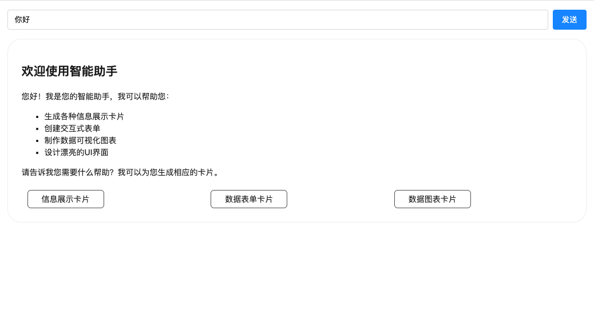

# Using the Renderer Component

Besides the integrated Chat component, GenUI SDK provides the core renderer component `GenuiRenderer`, which lets you compose logic more freely and control flows with finer granularity. This section shows a **minimal working example**: use the browser's native `fetch` to make a **streaming request**, then pass the streamed schema fragments to `GenuiRenderer` for rendering.

## Fetch the service and handle streaming responses

Create a file `fetch-schema-stream.ts`. Parse OpenAI-compatible SSE `delta.content`, then use core `PatternExtractor` to extract `` ```schemaJson `` chunks (default `SchemaJsonPattern`):

````typescript
import { PatternExtractor } from '@opentiny/genui-sdk-core';

export async function fetchSchemaStream(
  url: string,
  userInput: string,
  onSchemaUpdate: (schemaChunk: string) => void,
): Promise<void> {
  const response = await fetch(url, {
    method: 'POST',
    headers: { 'Content-Type': 'application/json' },
    body: JSON.stringify({
      messages: [{ role: 'user', content: userInput }],
      model: 'deepseek-v3.2',
      stream: true,
    }),
  });

  if (!response.ok) {
    throw new Error(`HTTP error! status: ${response.status}`);
  }

  const reader = response.body!.getReader();
  const decoder = new TextDecoder('utf-8');
  let buffer = '';

  const patternExtractor = new PatternExtractor({
    onNormalWrite: () => {},
    onHandledWrite: (value) => onSchemaUpdate(value),
  });

  try {
    while (true) {
      const { done, value } = await reader.read();
      if (done) break;

      buffer += decoder.decode(value, { stream: true });

      while (true) {
        const lineEndIndex = buffer.indexOf('\n');
        if (lineEndIndex === -1) break;

        const line = buffer.slice(0, lineEndIndex).trim();
        buffer = buffer.slice(lineEndIndex + 1);

        if (!line.startsWith('data:')) continue;

        const dataStr = line.slice(5).trim();

        if (dataStr === '[DONE]') {
          return;
        }

        try {
          const chunk = JSON.parse(dataStr);
          const content = chunk.choices?.[0]?.delta?.content;

          if (!content) continue;

          patternExtractor.handleContent(content);
        } catch (e) {
          console.error('Failed to parse backend data:', e, dataStr);
        }
      }
    }
  } finally {
    reader.releaseLock();
  }
}
````

## Use the Renderer component to accept streamed schemaJson

Create a simple Vue component with an input, send button, and render area. Configure an LLM service that can generate `schemaJson`:

```vue
<template>
  <GenuiConfigProvider :materials="materials">
    <div class="demo-container">
      <div class="input-group">
        <input v-model="inputText" placeholder="Enter your question..." @keyup.enter="handleSend" />
        <button @click="handleSend">Send</button>
      </div>
      <GenuiRenderer :content="schema" :key="rendererKey" />
    </div>
  </GenuiConfigProvider>
</template>

<script setup lang="ts">
import { ref } from 'vue';
import { GenuiRenderer } from '@opentiny/genui-sdk-vue/renderer';
import { GenuiConfigProvider } from '@opentiny/genui-sdk-vue/config-provider';
import { materials } from '@opentiny/genui-sdk-materials-vue-opentiny-vue/materials';
import { fetchSchemaStream } from './fetch-schema-stream';

const inputText = ref('');
const schema = ref<any>({ componentName: 'Page', children: [] });
const rendererKey = ref(0);
const generating = ref(false);

const handleSend = async () => {
  if (!inputText.value.trim() || generating.value) return;

  generating.value = true;
  schema.value = '';
  rendererKey.value++;
  const userInput = inputText.value;
  inputText.value = '';

  try {
    await fetchSchemaStream('https://your-chat-backend/api', userInput, (schemaChunk) => {
      schema.value += schemaChunk;
    });
  } catch (error) {
    console.error('Request failed:', error);
  } finally {
    generating.value = false;
  }
};
</script>

<style scoped>
.demo-container {
  padding: 16px;
  box-sizing: border-box;
}

.input-group {
  display: flex;
  gap: 8px;
  margin-bottom: 16px;
}

input {
  flex: 1;
  padding: 8px 12px;
  border: 1px solid #ddd;
  border-radius: 4px;
}

button {
  padding: 8px 16px;
  background: #1890ff;
  color: white;
  border: none;
  border-radius: 4px;
  cursor: pointer;
}
</style>
```

::: tip GenuiRenderer
For drop-in compatibility without configuring materials, see [GenuiRenderer Legacy compatibility](../components/renderer#compatibility-component-genuilegacyrenderer).
:::

## Try it now

This example uses `deepseek-v3.2` for testing. Sample output:



## Related documentation

- See the [Renderer component docs](../components/renderer) for the full API
- See [custom components example](../examples/renderer/custom-components) to learn how to create custom components
- See [custom actions example](../examples/renderer/custom-actions) to learn how to create custom actions
