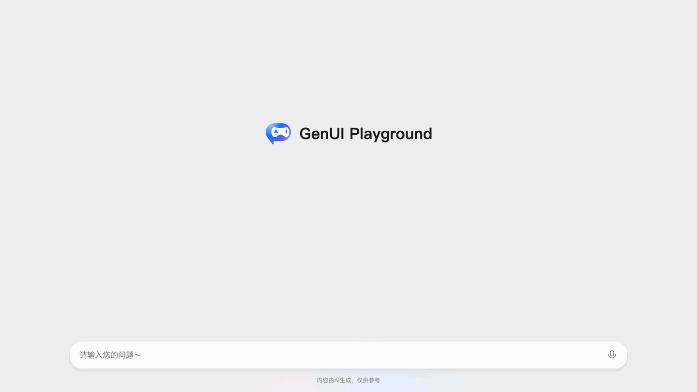

## What is Generative UI?

Generative UI is an innovative interaction pattern that renders structured LLM output into interactive user interfaces in real time. Unlike plain text chat, generative UI lets AI generate forms, buttons, charts, and other components so users can interact with AI more intuitively and efficiently.

