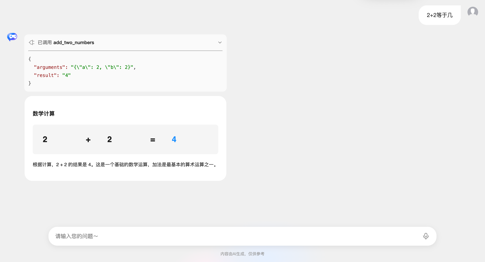

# Chat 组件 - 自定义 Fetch

`GenuiChat` 组件支持自定义 fetch 函数，允许你完全自定义 HTTP 请求的实现方式。这对于需要集成第三方 SDK、添加认证、处理工具调用、实现自定义流式响应等场景非常有用。

## 参数说明

- `url`: 请求地址
- `options.method`: HTTP 方法（通常为 'POST'）
- `options.headers`: 请求头对象
- `options.body`: 请求体（JSON 字符串），包含 `messages`、`model`、`temperature`、`metadata` (带有处理好的`customComponents`/`customSnippets`/`customExamples`/`customActions`)
- `options.signal`: AbortSignal，用于取消请求

## 返回值

必须返回 `Response` 对象或 `Promise<Response>`。响应需要符合 OpenAI 兼容的流式格式（SSE），或者返回标准的 JSON 响应。

## 使用场景

### 添加认证头

通过 `customFetch` prop 传递自定义的 fetch 函数：

```vue
<template>
  <GenuiChat :url="url" model="deepseek-v3.2" :customFetch="customFetch" />
</template>

<script setup lang="ts">
import { GenuiChat } from '@opentiny/genui-sdk-vue';
import type { CustomFetch } from '@opentiny/genui-sdk-vue';

const url = 'https://your-chat-backend/api';

const customFetch: CustomFetch = async (url, options) => {
  // 添加认证头
  const headers = {
    ...options.headers,
    'Authorization': `Bearer ${localStorage.getItem('authToken')}`,
  };

  const response = await fetch(url, {
    ...options,
    headers,
  });

  return response;
};
</script>
```

### 处理工具调用和多轮对话

使用 `customFetch` 可以实现工具调用（Function Calling）和多轮对话功能。下面通过一个完整的示例来演示如何实现。

#### 1. 定义工具（Tools）

首先，我们需要定义可用的工具。每个工具包含两个部分：`definition`（工具定义，符合 OpenAI 工具格式）和 `execute`（执行函数）。

```typescript
import OpenAI from 'openai';

/**
 * 计算两个数字的和的工具
 */
export const addTwoNumbersTool = {
  definition: {
    type: 'function' as const,
    function: {
      name: 'add_two_numbers',
      description:
        '计算两个数字的和。这是一个数学计算工具，用于将两个数字相加。调用时必须提供两个数字参数 a 和 b。示例：如果 a=5, b=3，则返回 8。',
      parameters: {
        type: 'object',
        properties: {
          a: {
            type: 'number',
            description: '第一个要相加的数字，必填，必须是数字类型。例如：5',
          },
          b: {
            type: 'number',
            description: '第二个要相加的数字，必填，必须是数字类型。例如：3',
          },
        },
        required: ['a', 'b'],
      },
    },
  },
  execute: async ({ a, b }: { a: number; b: number }) => {
    return a + b;
  },
};

/**
 * 所有可用的工具列表
 */
export const availableTools: Record<
  string,
  {
    definition: OpenAI.Chat.Completions.ChatCompletionTool;
    execute: (args: any) => Promise<any> | any;
  }
> = {
  add_two_numbers: addTwoNumbersTool,
};
```

#### 2. 实现 CustomFetch 处理工具调用

接下来，我们实现 `customFetch` 函数来处理工具调用和多轮对话：

```typescript
export function createOpenAICustomFetch(config: OpenAIConfig): CustomFetch {
  return async (
    url: string,
    options: {
      method: string;
      headers: Record<string, string>;
      body: string;
      signal?: AbortSignal;
    },
  ): Promise<Response> => {
    // 解析请求体
    const requestBody = JSON.parse(options.body);
    const { messages, model, temperature, metadata } = requestBody;

    try {
      const openai = new OpenAI({
        apiKey: config.apiKey,
        baseURL: config.baseURL,
        dangerouslyAllowBrowser: true,
      });

      const tools = Object.values(availableTools).map((tool) => tool.definition);
      const maxSteps = 20; // 最大工具调用步骤数

      // 将流转换为 SSE 格式的 Response
      const encoder = new TextEncoder();
      const readableStream = new ReadableStream<Uint8Array>({
        async start(controller) {
          try {
            let currentMessages = [...messages];
            let stepCount = 0;
            let completionId = `chatcmpl-${Date.now()}`;

            while (stepCount < maxSteps) {
              // 创建流式请求
              const stream = await openai.chat.completions.create(
                {
                  model,
                  messages: currentMessages,
                  temperature: temperature,
                  tools: tools.length > 0 ? tools : undefined,
                  tool_choice: tools.length > 0 ? 'auto' : undefined,
                  stream: true,
                },
                {
                  signal: options.signal,
                },
              );

              let assistantMessage: any = {
                role: 'assistant',
                content: null,
              };
              let toolCalls: any[] = [];
              let contentDelta = '';

              // 处理流式响应
              for await (const chunk of stream) {
                const choice = chunk.choices[0];
                if (!choice) continue;

                const delta = choice.delta;

                // 处理内容增量
                if (delta.content) {
                  contentDelta += delta.content;
                  const chunkData = {
                    id: chunk.id || completionId,
                    object: 'chat.completion.chunk',
                    model: chunk.model || model,
                    created: chunk.created || Math.floor(Date.now() / 1000),
                    choices: [
                      {
                        index: 0,
                        delta: { content: delta.content },
                        finish_reason: null,
                      },
                    ],
                  };
                  controller.enqueue(encoder.encode(`data: ${JSON.stringify(chunkData)}\n\n`));
                }

                // 处理工具调用（累积数据，不立即发送）
                if (delta.tool_calls) {
                  for (const toolCallDelta of delta.tool_calls) {
                    const index = toolCallDelta.index || 0;
                    if (!toolCalls[index]) {
                      toolCalls[index] = {
                        id: toolCallDelta.id || '',
                        type: 'function',
                        function: {
                          name: '',
                          arguments: '',
                        },
                      };
                    }
                    if (toolCallDelta.id) {
                      toolCalls[index].id = toolCallDelta.id;
                    }
                    if (toolCallDelta.function?.name) {
                      toolCalls[index].function.name =
                        (toolCalls[index].function.name || '') + toolCallDelta.function.name;
                    }
                    if (toolCallDelta.function?.arguments) {
                      toolCalls[index].function.arguments =
                        (toolCalls[index].function.arguments || '') + toolCallDelta.function.arguments;
                    }
                  }
                }

                // 处理完成
                if (choice.finish_reason) {
                  if (choice.finish_reason === 'tool_calls' && toolCalls.length > 0) {
                    // 发送完整的工具调用信息（只发送一次）
                    const toolCallChunk = {
                      id: chunk.id || completionId,
                      object: 'chat.completion.chunk',
                      model: chunk.model || model,
                      created: chunk.created || Math.floor(Date.now() / 1000),
                      choices: [
                        {
                          index: 0,
                          delta: {
                            tool_calls: toolCalls.map((toolCall, idx) => ({
                              index: idx,
                              id: toolCall.id,
                              type: 'function',
                              function: {
                                name: toolCall.function.name,
                                arguments: toolCall.function.arguments,
                              },
                            })),
                          },
                          finish_reason: null,
                        },
                      ],
                    };
                    controller.enqueue(encoder.encode(`data: ${JSON.stringify(toolCallChunk)}\n\n`));

                    // 执行工具调用
                    assistantMessage = {
                      role: 'assistant',
                      content: contentDelta || null,
                      tool_calls: toolCalls,
                    };
                    currentMessages.push(assistantMessage);

                    // 执行所有工具调用
                    const toolResults: any[] = [];
                    for (let i = 0; i < toolCalls.length; i++) {
                      const toolCall = toolCalls[i];
                      try {
                        const args = JSON.parse(toolCall.function.arguments);
                        const result = await executeToolCall(toolCall.function.name, args);

                        // 添加工具调用结果到消息历史
                        currentMessages.push({
                          role: 'tool',
                          tool_call_id: toolCall.id,
                          content: result,
                        });

                        toolResults.push({
                          index: i,
                          id: toolCall.id,
                          type: 'function',
                          function: {
                            name: toolCall.function.name,
                            arguments: toolCall.function.arguments,
                            result,
                          },
                        });
                      } catch (error) {
                        const errorResult = JSON.stringify({
                          error: error instanceof Error ? error.message : 'Unknown error',
                        });
                        currentMessages.push({
                          role: 'tool',
                          tool_call_id: toolCall.id,
                          content: errorResult,
                        });
                        toolResults.push({
                          index: i,
                          id: toolCall.id,
                          type: 'function',
                          function: {
                            name: toolCall.function.name,
                            arguments: toolCall.function.arguments,
                            result: errorResult,
                          },
                        });
                      }
                    }

                    // 发送所有工具调用结果块
                    if (toolResults.length > 0) {
                      const toolResultChunk = {
                        id: completionId,
                        object: 'chat.completion.chunk',
                        model: chunk.model || model,
                        created: chunk.created || Math.floor(Date.now() / 1000),
                        choices: [
                          {
                            index: 0,
                            delta: {
                              tool_calls_result: toolResults,
                            },
                            finish_reason: 'tool_calls',
                          },
                        ],
                      };
                      controller.enqueue(encoder.encode(`data: ${JSON.stringify(toolResultChunk)}\n\n`));
                    }

                    stepCount++;
                    // 继续下一轮对话
                    continue;
                  } else {
                    // 正常完成
                    if (contentDelta) {
                      assistantMessage.content = contentDelta;
                      currentMessages.push(assistantMessage);
                    }

                    // 发送完成块
                    const finishChunk = {
                      id: chunk.id || completionId,
                      object: 'chat.completion.chunk',
                      model: chunk.model || model,
                      created: chunk.created || Math.floor(Date.now() / 1000),
                      choices: [
                        {
                          index: 0,
                          delta: {},
                          finish_reason: choice.finish_reason,
                        },
                      ],
                    };
                    controller.enqueue(encoder.encode(`data: ${JSON.stringify(finishChunk)}\n\n`));
                    break;
                  }
                }
              }

              // 如果没有工具调用，退出循环
              if (toolCalls.length === 0) {
                break;
              }
            }

            // 发送结束标记
            controller.enqueue(encoder.encode('data: [DONE]\n\n'));
            controller.close();
          } catch (error) {
            const errorData = {
              error: {
                message: error instanceof Error ? error.message : 'Unknown error',
                type: 'stream_error',
              },
            };
            controller.enqueue(encoder.encode(`data: ${JSON.stringify(errorData)}\n\n`));
            controller.error(error);
          }
        },
        cancel() {
          // 清理资源
        },
      });

      return new Response(readableStream, {
        headers: {
          'Content-Type': 'text/event-stream',
          'Cache-Control': 'no-cache',
          'Connection': 'keep-alive',
        },
        status: 200,
      });
    } catch (error: any) {
      console.error('[OpenAI SDK Error]', {
        url,
        error: error.message,
      });

      // 返回错误响应
      return new Response(
        JSON.stringify({
          error: {
            message: error.message,
            type: error.type || 'unknown',
            code: 500,
          },
        }),
        {
          status: 500,
          headers: {
            'Content-Type': 'application/json',
          },
        },
      );
    }
  };
}
```

关键实现点：

1. **多轮对话循环**：使用 `while` 循环处理多轮工具调用，最多执行 `maxSteps` 次
2. **消息历史管理**：维护 `currentMessages` 数组，包含用户消息、助手消息和工具调用结果
3. **工具调用处理**：
   - 累积流式响应中的工具调用数据
   - 当 `finish_reason` 为 `tool_calls` 时，执行所有工具调用
   - 将工具调用结果添加到`currentMessages`中，继续下一轮对话
4. **流式响应转换**：将 OpenAI SDK 的流式响应转换为 SSE 格式，否则组件无法正常处理，
5. **工具调用结果发送**：通过 `tool_calls_result` delta 字段发送工具执行结果，让组件能够正确更新工具调用状态并显示调用结果。

#### 3. 在应用中使用

最后，在 Vue 组件中使用自定义的 `customFetch`：

```vue
<template>
  <div class="app-container">
    <GenuiChat
      url="http://localhost:3100/"
      :customFetch="defaultCustomFetch"
      model="deepseek-v3.2"
      :temperature="0.5"
      :chatConfig="chatConfig"
    />
  </div>
</template>

<script setup lang="ts">
import { GenuiChat } from '@opentiny/genui-sdk-vue';
import { defaultCustomFetch } from './api/custom-fetch';

const chatConfig = {
  addToolCallContext: true,
  showThinkingResult: true,
};
</script>

<style scoped>
.app-container {
  width: 100%;
  height: 100vh;
  display: flex;
  flex-direction: column;
}
</style>
```

## 体验工具调用

完成以上步骤后，就可以体验工具调用了，能够在对话中查看工具调用参数和结果：


