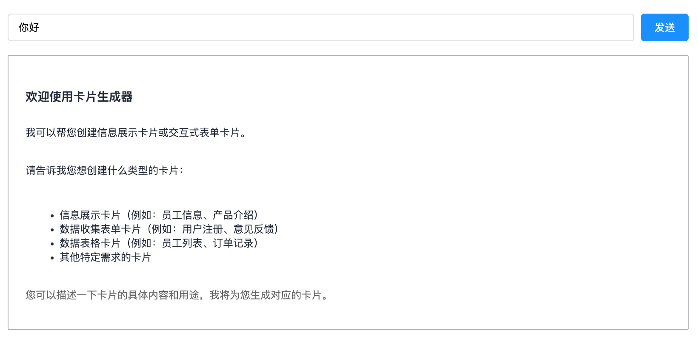

# 使用 Renderer 组件

核心渲染器 Renderer 组件（`GenuiRenderer`），可以使用其进行更自由的逻辑组合、更精密流程控制。本节展示一个**最小可用示例**：使用浏览器原生 `fetch` 发起 **流式请求**，然后把流式返回的 schema 片段交给 `GenuiRenderer` 渲染。

## 使用 fetch 请求服务，处理流式返回

创建一个文件 `fetch-schema-stream.ts`, 文件中的处理逻辑都是基于 OpenAI 兼容格式处理：

````ts {14-18}
// fetch-schema-stream.ts
export async function fetchSchemaStream(
  url: string,
  userInput: string,
  onSchemaUpdate: (schemaChunk: string) => void,
): Promise<void> {
  const response = await fetch(url, {
    method: 'POST',
    headers: { 'Content-Type': 'application/json' },
    body: JSON.stringify({
      messages: [{ role: 'user', content: userInput }],
      model: 'deepseek-v3.2',
      stream: true,
      metadata: {
        tinygenui: JSON.stringify({
          framework: 'Angular'
        }),
      },
    }),
  });

  if (!response.ok) {
    throw new Error(`HTTP error! status: ${response.status}`);
  }

  const reader = response.body.getReader();
  const decoder = new TextDecoder('utf-8');
  let buffer = '';

  let inSchemaStream = false;
  let bufferText = '';
  let schemaFinished = false;
  const startFlag = '```schemaJson';
  const endFlag = '```';

  // 检测 schema 开始标记
  const isSchemaJsonStart = (str: string): boolean => {
    const index = str.indexOf('`');
    if (index === -1) return false;
    return startFlag.startsWith(str.substring(index, index + startFlag.length));
  };

  // 检测 schema 结束标记
  const isSchemaJsonEnd = (str: string): boolean => {
    const index = str.lastIndexOf('\n');
    if (index === -1) return false;
    if (str.includes(`\n${endFlag}`)) {
      return true;
    }
    const newStr = str.slice(index).trim().substring(0, endFlag.length);
    return endFlag.startsWith(newStr);
  };

  try {
    while (true) {
      const { done, value } = await reader.read();
      if (done) break;

      buffer += decoder.decode(value, { stream: true });

      while (true) {
        const lineEndIndex = buffer.indexOf('\n');
        if (lineEndIndex === -1) break;

        const line = buffer.slice(0, lineEndIndex).trim();
        buffer = buffer.slice(lineEndIndex + 1);

        if (!line.startsWith('data: ')) continue;

        const dataStr = line.slice(6);

        if (dataStr === '[DONE]' || schemaFinished) {
          return;
        }

        try {
          const chunk = JSON.parse(dataStr);
          const content = chunk.choices?.[0]?.delta?.content;

          if (!content) continue;

          const deltaPart = bufferText + content;

          // 检测是否进入或退出 schema 流
          if ((!inSchemaStream && isSchemaJsonStart(deltaPart)) || (inSchemaStream && isSchemaJsonEnd(deltaPart))) {
            const matchFlag = inSchemaStream ? /(\n\s*)```/ : startFlag;
            const matchPart = deltaPart.match(matchFlag)?.[0];

            if (!matchPart) {
              // 标记不完整，保留到下次
              bufferText = deltaPart;
              continue;
            }

            if (inSchemaStream) {
              const trimmedDelta = deltaPart.trim();
              const [schemaPart] = trimmedDelta.split(matchPart);
              if (schemaPart) {
                onSchemaUpdate(schemaPart);
              }
              schemaFinished = true;
              return;
            } else {
              const trimmedDelta = deltaPart.trim();
              const [, schemaPart] = trimmedDelta.split(matchPart);
              inSchemaStream = true;
              bufferText = '';
              if (schemaPart) {
                onSchemaUpdate(schemaPart);
              }
              continue;
            }
          }

          bufferText = '';
          if (inSchemaStream) {
            onSchemaUpdate(deltaPart);
          }
        } catch (e) {
          console.error('解析后端数据失败:', e, dataStr);
        }
      }
    }
  } finally {
    reader.releaseLock();
  }
}
````

## 使用 Renderer 组件接受流式返回的 schemaJson

创建一个简单的组件，包含输入框、发送按钮和渲染区域，配置一下能够生成 schemaJson 的 LLM 服务：

```ts {8, 15,61-63}
import { Component } from '@angular/core';
import { FormsModule } from '@angular/forms';
import { GenuiRenderer } from '@opentiny/genui-sdk-angular';
import { fetchSchemaStream } from '../fetch-schema-stream';

@Component({
  selector: 'genui-example',
  imports: [FormsModule, GenuiRenderer],
  template: `
  <div class="demo-container">
    <div class="input-group">
      <input [(ngModel)]="inputText" type="text" placeholder="请输入问题..." (keyup.enter)="handleSend()" />
      <button (click)="handleSend()">发送</button>
    </div>
    <genui-renderer [content]="schema"> </genui-renderer>
  </div>
  `,
  styles: [`
.demo-container {
  padding: 16px;
  box-sizing: border-box;
}

.input-group {
  display: flex;
  gap: 8px;
  margin-bottom: 16px;
}

input {
  flex: 1;
  padding: 8px 12px;
  border: 1px solid #ddd;
  border-radius: 4px;
}

button {
  padding: 8px 16px;
  background: #1890ff;
  color: white;
  border: none;
  border-radius: 4px;
  cursor: pointer;
}
  `],
})
export class GenuiExample {
  inputText = '';
  schema = '';
  rendererKey = '';
  generating = false;
  async handleSend() {
    if (!this.inputText.trim() || this.generating) return;

    this.generating = true;
    this.schema = '';
    const userInput = this.inputText;
    this.inputText = '';

    try {
      await fetchSchemaStream('https://<your-backend-api>/chat/completions', userInput, (schemaChunk: string) => {
        this.schema += schemaChunk;
      });
    } catch (error) {
      console.error('请求失败:', error);
    } finally {
      this.generating = false;
    }
  }
  handlePrint(schema: any) {
    console.log(schema);
  }
}

```

## 输入问题立即体验

测试返回如下：



## 其他相关文档

- 查看 [Renderer 组件文档](../../components/angular/renderer) 了解详细的 API
- 查看 [自定义组件示例](../../examples/angular/renderer/custom-components) 学习如何创建自定义组件
- 查看 [自定义操作示例](../../examples/angular/renderer/custom-actions) 学习如何创建自定义操作
