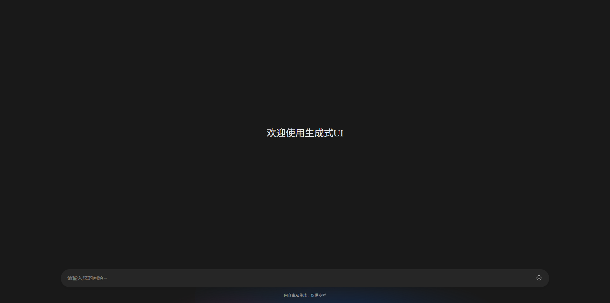

# 快速开始

本文将帮助你快速上手 GenUI SDK，通过 `GenuiChat` 组件快速开始使用生成式 UI。

`GenuiChat` 是一个集成的对话组件，内部已经封装了会话管理、流式返回、生成状态等功能，是最简单的使用方式。

## 初始化项目

首先，创建一个新的 Vue 项目：
```bash
npm create vue@latest genui-chat
```

按照默认提示进行项目初始化。

## 安装依赖

进入项目目录并安装 GenUI SDK：
::: tabs
== npm
```bash
cd genui-chat
npm install @opentiny/genui-sdk-vue
```
== pnpm
```bash
cd genui-chat
pnpm add @opentiny/genui-sdk-vue
```
== yarn
```bash
cd genui-chat
yarn add @opentiny/genui-sdk-vue
```
:::

## 改造项目

### 修改 `src/main.js` 或 `src/main.ts`

删除 Vue 初始化工程引入的样式：

```js
import './assets/main.css'; // [!code --]

import { createApp } from 'vue';
import App from './App.vue';

createApp(App).mount('#app');
```

### 修改 `src/App.vue`

使用 `GenuiChat` 组件：

```vue
<script setup lang="ts">
import { GenuiChat } from '@opentiny/genui-sdk-vue';
</script>

<template>
  <GenuiChat />
</template>

<style>
body,
html {
  padding: 0;
  margin: 0;
}
#app {
  position: fixed;
  width: 100vw;
  height: 100vh;
}
.tiny-config-provider {
  height: 100%;
}
</style>
```

## 启动项目

运行以下命令启动开发服务器：

```bash
npm run dev
```

现在你可以在浏览器中看到 GenUI Chat 界面了！

## 配置 GenuiChat

你可以通过`url` 、 `model` 和 `temperature` 属性配置大模型参数：

```vue
<script setup lang="ts">
import { ref } from 'vue'; // [!code ++]
import { GenuiChat } from '@opentiny/genui-sdk-vue';

const url = 'https://your-chat-backend/api'; // [!code ++]
const model = ref('deepseek-v3.2'); // [!code ++]
const temperature = ref(0.7); // [!code ++]
</script>

<template>
  <GenuiChat> <!-- [!code --]-->
  <GenuiChat :url="url" :model="model" :temperature="temperature" />  <!-- [!code ++]-->
</template>
```

## 通过 GenuiConfigProvider 配置主题

你可以使用 `GenuiConfigProvider` 组件为 `GenuiChat` 配置主题。目前内置了三个主题。
三个主题共四个选项：
- `'dark'`：深色主题
- `'lite'`：清新主题
- `'light'`：浅色主题
- `'auto'`：自动跟随浏览器

默认值为 `'light'`。

### 基础用法

使用 `GenuiConfigProvider` 包裹 `GenuiChat` 组件：

```vue
<script setup lang="ts">
import { ref } from 'vue';
import { GenuiChat } from '@opentiny/genui-sdk-vue'; // [!code --]
import { GenuiChat, GenuiConfigProvider } from '@opentiny/genui-sdk-vue'; // [!code ++]

const url = 'https://your-chat-backend/api';
const model = ref('deepseek-v3.2');
const temperature = ref(0.7);
</script>

<template>
  <!-- [!code ++]-->
  <GenuiConfigProvider theme="dark">
    <GenuiChat :url="url" :model="model" :temperature="temperature" />
    <!-- [!code ++]-->
  </GenuiConfigProvider>
</template>
```

### 完整示例

结合配置和主题的完整示例：

```vue
<script setup lang="ts">
import { ref } from 'vue';
import { GenuiChat, GenuiConfigProvider } from '@opentiny/genui-sdk-vue';

const url = 'https://your-chat-backend/api';
const model = ref('deepseek-v3.2');
const temperature = ref(0.7);
const theme = ref<'dark' | 'lite' | 'light' | 'auto'>('dark');
</script>

<template>
  <GenuiConfigProvider :theme="theme">
    <GenuiChat :url="url" :model="model" :temperature="temperature" />
  </GenuiConfigProvider>
</template>

<style>
body,
html {
  padding: 0;
  margin: 0;
}
#app {
  position: fixed;
  width: 100vw;
  height: 100vh;
}
.tiny-config-provider {
  height: 100%;
}
</style>
```

完成以上步骤后，即可开始体验生成式 UI 了


## 其他相关文档

- 查看 [组件文档](../components/chat) 了解 `GenuiChat` 的详细 API
- 查看 [Renderer 使用指南](start-with-renderer) 了解如何使用 `GenuiRenderer` 进行更精细的控制
- 查看 [特性示例](../examples/chat) 学习高级用法
