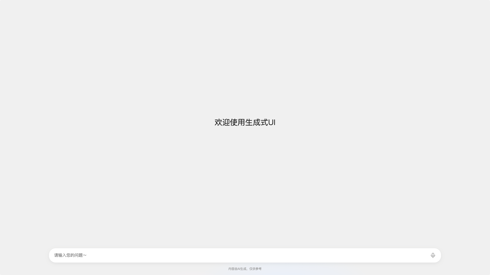

# 快速开始

本文将帮助你快速上手 GenUI SDK，通过 `GenuiChat` 组件快速开始使用生成式 UI。

`GenuiChat` 是一个集成的对话组件，内部已经封装了会话管理、流式返回、生成状态等功能，是最简单的使用方式。

## 初始化项目

首先，创建一个新的 Vue 项目：
```bash
npm create vue@latest genui-chat
```

按照默认提示进行项目初始化。

## 安装依赖

进入项目目录并安装 GenUI SDK 与官方物料包：
::: tabs
== npm
```bash
cd genui-chat
npm install @opentiny/genui-sdk-vue @opentiny/genui-sdk-materials-vue-opentiny-vue
```
== pnpm
```bash
cd genui-chat
pnpm add @opentiny/genui-sdk-vue @opentiny/genui-sdk-materials-vue-opentiny-vue
```
== yarn
```bash
cd genui-chat
yarn add @opentiny/genui-sdk-vue @opentiny/genui-sdk-materials-vue-opentiny-vue
```
:::

## 改造项目

### 修改 `src/main.js` 或 `src/main.ts`

删除 Vue 初始化工程引入的样式：

```js
import './assets/main.css'; // [!code --]

import { createApp } from 'vue';
import App from './App.vue';

createApp(App).mount('#app');
```

### 修改 `src/App.vue`

使用 `GenuiConfigProvider` 注入物料，并渲染 `GenuiChat`：

```vue
<script setup lang="ts">
import { GenuiChat, GenuiConfigProvider } from '@opentiny/genui-sdk-vue';
import { materials } from '@opentiny/genui-sdk-materials-vue-opentiny-vue/materials';
</script>

<template>
  <GenuiConfigProvider :materials="materials">
    <GenuiChat />
  </GenuiConfigProvider>
</template>

<style>
body,
html {
  padding: 0;
  margin: 0;
}
#app {
  position: fixed;
  width: 100vw;
  height: 100vh;
}
.tiny-config-provider {
  height: 100%;
}
</style>
```

## 启动项目

运行以下命令启动开发服务器：

```bash
npm run dev
```

现在你可以在浏览器中看到 GenUI Chat 界面了！

## 配置 GenuiChat

你可以通过 `url`、`model` 和 `temperature` 属性配置大模型参数：

```vue
<script setup lang="ts">
import { ref } from 'vue'; // [!code ++]
import { GenuiChat, GenuiConfigProvider } from '@opentiny/genui-sdk-vue';
import { materials } from '@opentiny/genui-sdk-materials-vue-opentiny-vue/materials';

const url = 'https://your-chat-backend/api'; // [!code ++]
const model = ref('deepseek-v3.2'); // [!code ++]
const temperature = ref(0.7); // [!code ++]
</script>

<template>
  <GenuiConfigProvider :materials="materials">
    <GenuiChat /> <!-- [!code --]-->
    <GenuiChat :url="url" :model="model" :temperature="temperature" />  <!-- [!code ++]-->
  </GenuiConfigProvider>
</template>
```

## 通过 GenuiConfigProvider 配置物料与主题

物料与主题都通过 `GenuiConfigProvider` 配置：`materials` 注入组件物料，`theme` 控制界面主题。

内置主题选项：
- `'dark'`：深色主题
- `'lite'`：清新主题
- `'light'`：浅色主题（默认）
- `'auto'`：自动跟随浏览器

```vue
<script setup lang="ts">
import { ref } from 'vue';
import { GenuiChat, GenuiConfigProvider } from '@opentiny/genui-sdk-vue';
import { materials } from '@opentiny/genui-sdk-materials-vue-opentiny-vue/materials';

const url = 'https://your-chat-backend/api';
const model = ref('deepseek-v3.2');
const temperature = ref(0.7);
</script>

<template>
  <GenuiConfigProvider theme="light" :materials="materials">
    <GenuiChat :url="url" :model="model" :temperature="temperature" />
  </GenuiConfigProvider>
</template>
```

## 配置空插槽

为了让界面在没有对话的时候更加美观和友好，可以通过 `empty` 插槽配置欢迎语或推荐场景。

```vue
<template>
  <GenuiConfigProvider theme="light" :materials="materials">
    <GenuiChat :url="url" :model="model" :temperature="temperature">
      <template #empty>
        <div class="empty-text">欢迎使用生成式UI</div>
      </template>
    </GenuiChat>
  </GenuiConfigProvider>
</template>
```

添加样式：

```css
.empty-text { /* [!code ++] */
  height: 100%; /* [!code ++] */
  display: flex; /* [!code ++] */
  justify-content: center; /* [!code ++] */
  align-items: center; /* [!code ++] */
  font-size: 30px; /* [!code ++] */
} /* [!code ++] */
```

### 完整示例

```vue
<script setup lang="ts">
import { ref } from 'vue';
import { GenuiChat, GenuiConfigProvider } from '@opentiny/genui-sdk-vue';
import { materials } from '@opentiny/genui-sdk-materials-vue-opentiny-vue/materials';

const url = 'https://your-chat-backend/api';
const model = ref('deepseek-v3.2');
const temperature = ref(0.7);
const theme = ref<'dark' | 'lite' | 'light' | 'auto'>('light');
</script>

<template>
  <GenuiConfigProvider :theme="theme" :materials="materials">
    <GenuiChat :url="url" :model="model" :temperature="temperature">
      <template #empty>
        <div class="empty-text">欢迎使用生成式UI</div>
      </template>
    </GenuiChat>
  </GenuiConfigProvider>
</template>

<style>
body,
html {
  padding: 0;
  margin: 0;
}
#app {
  position: fixed;
  width: 100vw;
  height: 100vh;
}
.tiny-config-provider {
  height: 100%;
}
.empty-text {
  height: 100%;
  display: flex;
  justify-content: center;
  align-items: center;
  font-size: 30px;
}
</style>
```

完成以上步骤后，即可开始体验生成式 UI 了。



## 按需引入

`@opentiny/genui-sdk-vue` 除主入口外，还提供按功能拆分的子路径导出。只需 Chat、Renderer 或代码生成时，可从对应子路径引入，在构建工具对摇树不友好时，避免打入未使用的模块。

| 子路径 | 适用场景 | 主要导出内容 |
| --- | --- | --- |
| `@opentiny/genui-sdk-vue/chat` | 仅需对话组件 | `GenuiChat` |
| `@opentiny/genui-sdk-vue/renderer` | 仅需渲染器（自建对话 UI） | `GenuiRenderer` |
| `@opentiny/genui-sdk-vue/config-provider` | 主题/国际化/物料配置容器 | `GenuiConfigProvider` |
| `@opentiny/genui-sdk-vue/code-generator` | 将 SchemaJSON 转为 Vue SFC | [`generateCode`](../components/code-generator) |

```ts
import { GenuiChat } from '@opentiny/genui-sdk-vue/chat';
import { GenuiConfigProvider } from '@opentiny/genui-sdk-vue/config-provider';
import { materials } from '@opentiny/genui-sdk-materials-vue-opentiny-vue/materials';

// 仅使用 Renderer
import { GenuiRenderer } from '@opentiny/genui-sdk-vue/renderer';

// 仅使用代码生成
import { generateCode } from '@opentiny/genui-sdk-vue/code-generator';
```

::: tip
1.3.0 版本进行了物料解耦重构。若需使用内置 TinyVue 组件物料，可使用 `GenuiLegacyChat`，详见 [GenuiChat Legacy 兼容说明](../components/chat#兼容组件-genuilegacychat)。
:::

## 其他相关文档

- 查看 [组件文档](../components/chat) 了解 `GenuiChat` 的详细 API
- 查看 [generateCode](../components/code-generator) 了解如何将 SchemaJSON 转为 Vue SFC
- 查看 [Renderer 使用指南](start-with-renderer) 了解如何使用 `GenuiRenderer` 进行更精细的控制
- 查看 [特性示例](../examples/chat/custom-actions) 学习高级用法
