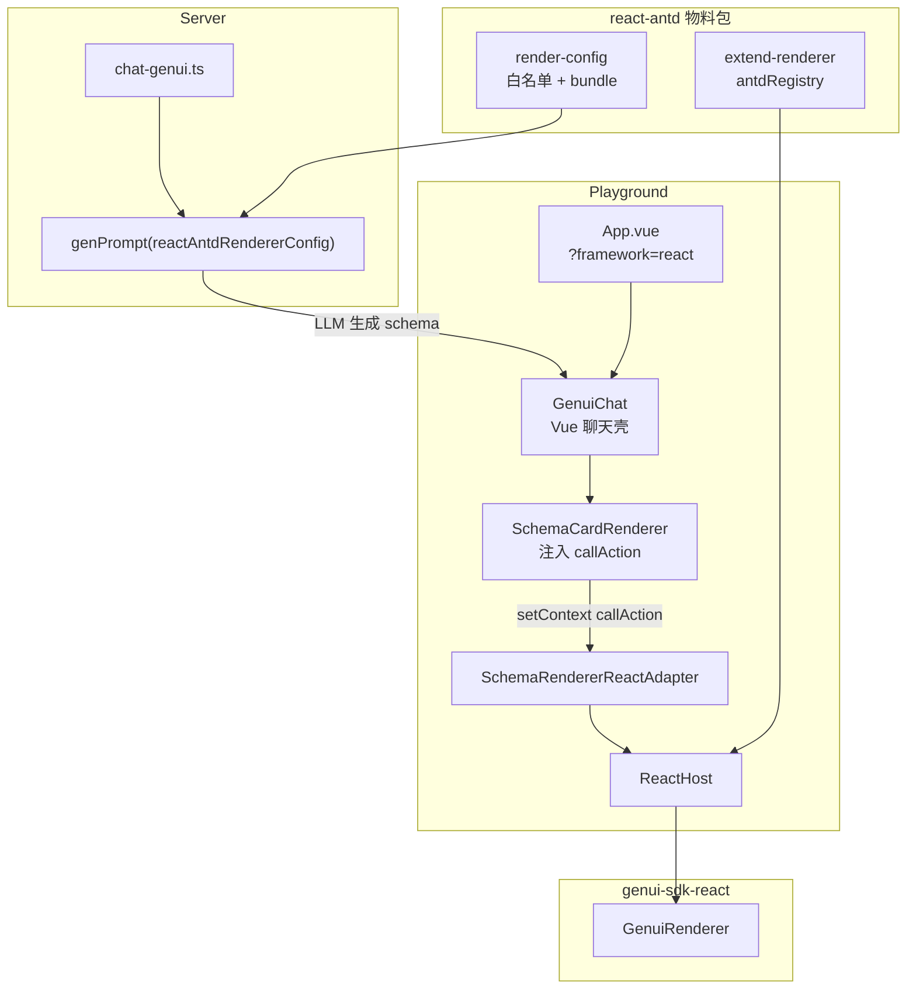

# @opentiny/genui-sdk-materials-react-antd

Ant Design 5 的 GenUI 物料包，为 React 渲染器提供 **运行时组件注册** 与 **LLM Prompt 配置**，模式与 `@opentiny/genui-sdk-materials-vue-opentiny-vue` 一致。

## 为什么需要物料包

GenUI 集成第三方 UI 库需要同时改两条链路：

| 链路 | 作用 | 本包提供 |
|------|------|----------|
| **Prompt 侧** | 告诉 LLM 可用的 `componentName` 及 props | `reactAntdRendererConfig`（白名单 + bundle 元数据 + 示例） |
| **运行时** | 把 schema 节点映射到真实 React 组件 | `antdRegistry`（`Ant*` 适配器） |

只改 prompt 不注册 registry → LLM 生成 `AntButton` 但渲染为占位 `[AntButton]`；只注册 registry 不改 prompt → LLM 不知道这些组件。

```
LLM（genPrompt + reactAntdRendererConfig）
        ↓ 生成 schema
GenuiRenderer / SchemaRenderer
        ↓ componentName 查找
antdRegistry + builtinRegistry
        ↓
Ant Design 组件
```

## 包结构

```
packages/materials/react-antd/
├── package.json
├── vite.config.ts              # 三入口：index / render-config / extend-renderer
└── src/
    ├── index.ts                # 统一导出
    ├── extend-renderer.tsx     # antdRegistry 运行时注册表
    ├── components/
    │   └── adapt.tsx           # 通用 adapt / bindModelChange 等工具
    └── render-config/
        ├── merge.ts            # reactAntdRendererConfig
        ├── white-list.ts       # Ant* 白名单
        ├── bundle.json         # 组件 props/events 元数据（供 genPrompt）
        └── example-schema.ts   # Ant Design 表单示例
```

## 导出子路径

| 子路径 | 内容 |
|--------|------|
| `@opentiny/genui-sdk-materials-react-antd` | 全部导出 |
| `.../render-config` | `reactAntdRendererConfig`、`antdFormExample` 等 |
| `.../extend-renderer` | `antdRegistry`、`mergeAntdRegistry` |

## 已接入组件（Ant* 命名）

与原生 `Button` / `Input` 并存，避免命名冲突：

| componentName | antd 组件 | 说明 |
|---------------|-----------|------|
| `AntButton` | Button | `text` → children |
| `AntInput` | Input | 支持 `modelValue` / `value` + `model: true` |
| `AntSelect` | Select | 选项 `options`，绑定用 `value` + `model: true` |
| `AntForm` | Form | 容器 |
| `AntFormItem` | Form.Item | 仅 `label`，数据绑定在子组件上，**不用 `name`** |
| `AntCard` | Card | 使用 `variant`（`outlined` / `borderless` / `filled`） |
| `AntTable` | Table | `columns` + `dataSource` |
| `AntTabs` / `AntTabPane` | Tabs | 标签页 |
| `AntModal` | Modal | `open` / `onOk` / `onCancel` |
| `AntSwitch` | Switch | `checked` + `model: true` |
| `AntCheckbox` | Checkbox | `checked` + `text` |
| `AntRadio` | Radio | |
| `AntDatePicker` | DatePicker | |

## Prompt 配置：`reactAntdRendererConfig`

[`src/render-config/merge.ts`](src/render-config/merge.ts) 在 React 原生配置基础上扩展，**不替换** HTML 白名单：

```ts
import { reactRendererConfig, whiteList as reactWhiteList } from '@opentiny/genui-sdk-react/render-config';

export const reactAntdRendererConfig = {
  materialsList: [...reactRendererConfig.materialsList, antdBundle],
  whiteList: [...reactWhiteList, ...antdWhiteList],
  examples: [...reactRendererConfig.examples, ...antdExamples],
};
```

服务端通过 `genPrompt(reactAntdRendererConfig, customConfig)` 生成 system prompt，无需修改 `genPrompt` 源码。

## 运行时：`antdRegistry`

适配器签名与 `@opentiny/genui-sdk-react` 一致：

```tsx
type ComponentRenderer = (p: {
  props: Record<string, unknown>;
  children?: ReactNode;
  emit: (event: string) => void;
  loading?: boolean;
}) => ReactNode;
```

使用方式：

```tsx
import { GenuiRenderer } from '@opentiny/genui-sdk-react';
import { antdRegistry } from '@opentiny/genui-sdk-materials-react-antd/extend-renderer';
import 'antd/dist/reset.css';

<GenuiRenderer
  content={schema}
  isJsonComplete
  customComponents={antdRegistry}
/>
```

## Schema 编写约定

### 表单数据绑定

GenUI 使用 schema state + `model: true`，**不依赖** antd Form 的 `name` 字段：

```json
{
  "componentName": "AntInput",
  "props": {
    "placeholder": "请输入姓名",
    "modelValue": {
      "type": "JSExpression",
      "model": true,
      "value": "this.state.formData.name"
    }
  }
}
```

`AntSelect` / `AntSwitch` / `AntCheckbox` 等用 `value` 或 `checked` + `model: true`。

### 提交与重置

```json
{
  "methods": {
    "handleSubmit": {
      "type": "JSFunction",
      "value": "function() { this.callAction('saveState'); this.callAction('continueChat', { message: '提交成功' }); }"
    },
    "resetForm": {
      "type": "JSFunction",
      "value": "function() { this.state.formData = { name: '', email: '' }; }"
    }
  }
}
```

Playground 内置 `saveState`、`continueChat` 两个 customAction，由 Vue 壳注入 `callAction`。

---

## Playground 集成说明

Playground 仍用 **Vue 聊天壳 + React 渲染适配器** 架构，物料包在三处接入：

### 1. 启用 React 框架

[`sites/playground/web/src/App.vue`](../../sites/playground/web/src/App.vue)：

```ts
if (location.search.includes('framework=react')) {
  provide(GENUI_RENDERER, SchemaRendererReactAdapter);
  framework = 'React';
}
```

访问：`http://localhost:5173/?framework=react`

### 2. LLM Prompt（Server）

[`sites/playground/server/src/chat-genui.ts`](../../sites/playground/server/src/chat-genui.ts)：

```ts
import { reactAntdRendererConfig } from '@opentiny/genui-sdk-materials-react-antd/render-config';

const renderConfigForFramework =
  framework === 'Angular' ? ngRendererConfig
  : framework === 'React' ? reactAntdRendererConfig
  : rendererConfig;
```

[`sites/playground/server/package.json`](../../sites/playground/server/package.json) 增加 workspace 依赖。

### 3. 运行时渲染（React 适配器）

[`sites/playground/schema-renderer-react-adapter/`](../../sites/playground/schema-renderer-react-adapter/)：

| 文件 | 改动 |
|------|------|
| `ReactHost.tsx` | 注入 `customComponents={antdRegistry}`，引入 `antd/dist/reset.css` |
| `SchemaRendererReactAdapter.vue` | Vue 壳组件，pending context 机制同步 `callAction` |
| `package.json` | 依赖 `@opentiny/genui-sdk-materials-react-antd`、`antd` |

Vue 侧 [`SchemaCardRenderer.vue`](../../packages/frameworks/vue/src/renderer/SchemaCardRenderer.vue) 负责把 `saveState` / `continueChat` 通过 `setContext({ callAction })` 注入 React 渲染器。

### 4. 独立 Demo 页

[`sites/playground/web/src/react-demo/main.ts`](../../sites/playground/web/src/react-demo/main.ts)：

- 访问 `/react-demo.html`
- 使用 `antdRegistry` + `antdFormExample` 静态演示

### 5. 开发路径别名

[`sites/playground/server/tsconfig.dev.json`](../../sites/playground/server/tsconfig.dev.json)  
[`sites/playground/web/tsconfig.dev.json`](../../sites/playground/web/tsconfig.dev.json)

指向 `packages/materials/react-antd/src/...`，dev 模式下无需先 build 物料包。

### 集成数据流



---

## 构建

```bash
# 构建所有物料包（含 react-antd）
pnpm build:materials

# 仅构建本包
pnpm --filter @opentiny/genui-sdk-materials-react-antd build
```

根目录 `build:materials` 使用 `@opentiny/genui-sdk-materials-*` 通配，新包自动纳入。

## 业务项目接入（非 Playground）

1. 安装 `@opentiny/genui-sdk-react`、`@opentiny/genui-sdk-materials-react-antd`、`antd`
2. 渲染：`customComponents={antdRegistry}` + 引入 antd CSS
3. 服务端 prompt：`genPrompt(reactAntdRendererConfig, ...)`
4. 若需 `saveState` / `continueChat`，自行实现 `customActions` 或通过 `setContext({ callAction })` 注入

## 扩展更多 antd 组件

1. 在 [`src/extend-renderer.tsx`](src/extend-renderer.tsx) 增加适配器
2. 在 [`src/render-config/bundle.json`](src/render-config/bundle.json) 补充 props 元数据
3. 在 [`src/render-config/white-list.ts`](src/render-config/white-list.ts) 加入 componentName
4. 可选：在 [`example-schema.ts`](src/render-config/example-schema.ts) 增加示例

## 相关文档

- [React 渲染器架构](../../frameworks/react/docs/REACT_RENDERER.md)
- [Vue OpenTiny 物料包](../vue-opentiny-vue/)（同类参考实现）
